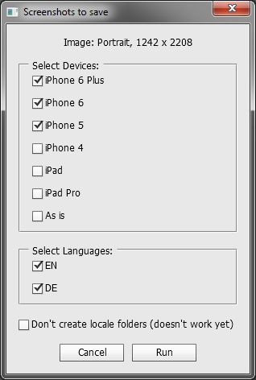

# Make Screenshots for App Stores
This is a script for Adobe Photoshop to to automatically save localized screenshots for App Stores.



### How to
1. Get Make `Screenshots.jsx`
2. Place it into  Photoshop scripts folder (`~\Adobe Photoshop CS6/Presets/Scripts/`)
3. Launch Photoshop
4. Open your appropriately structured file (see the sample)
5. Run script (`File->Scripts->Make Screenshots`)

## You will get
Here's the example file structure you'll get:
```
my_screenshots_folder/
      |____/iPhone 6 Plus/
      |       |____/EN/
      |       |     |____/my_screenshot.jpg
      |       |____/DE/
      |             |____/my_screenshot.jpg
      |____/iPhone 6/
      |       |____/EN/
      |       |     |____/my_screenshot.jpg
      |       |____/DE/
      |             |____/my_screenshot.jpg
      |____/my_screenshot.psd
```     
